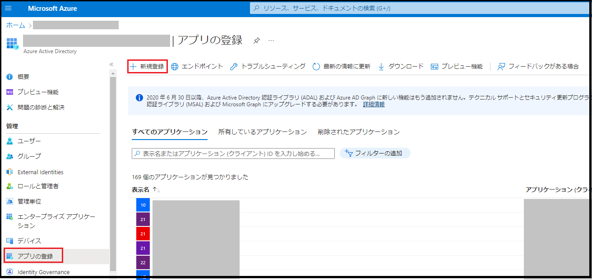
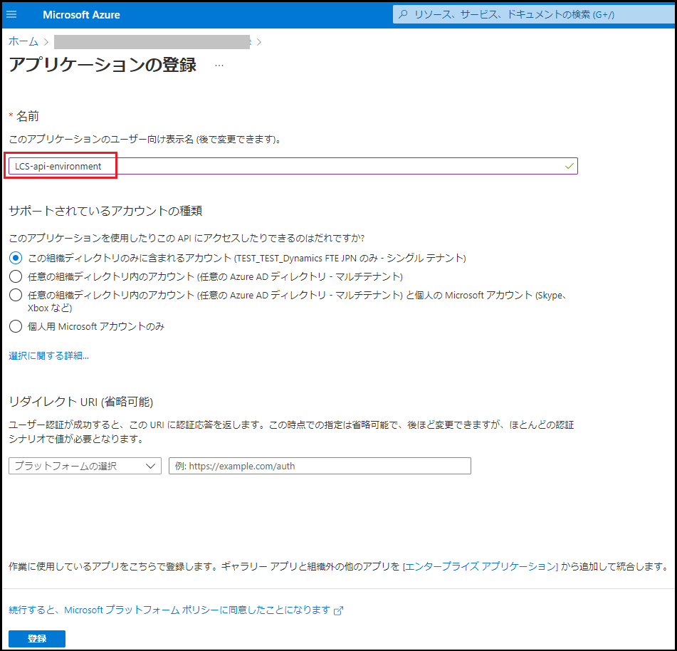
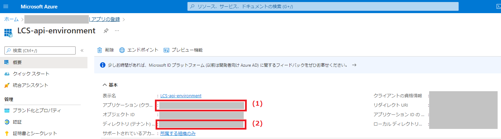
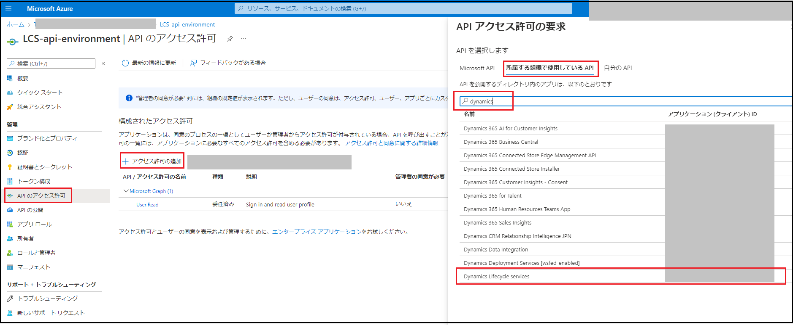
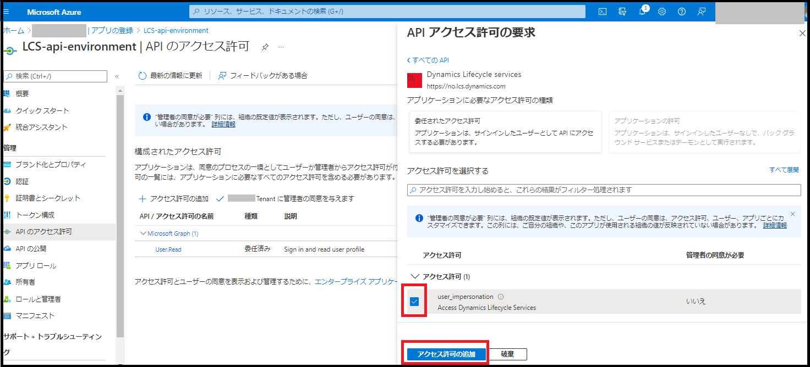
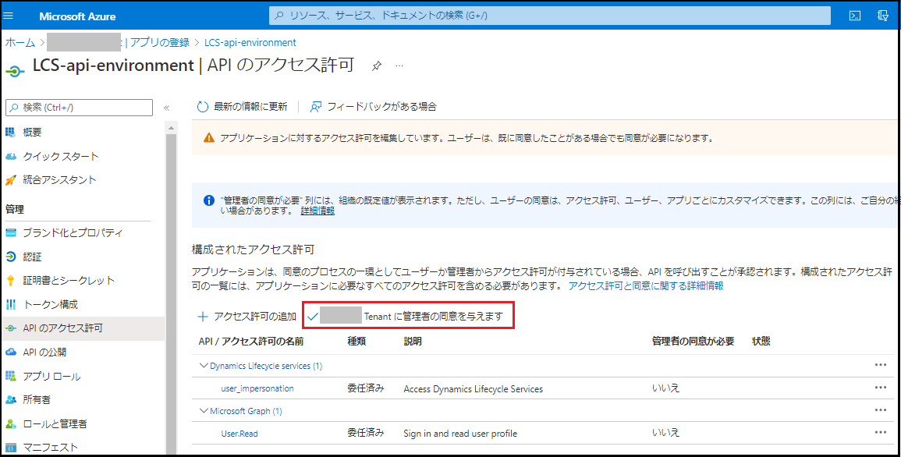
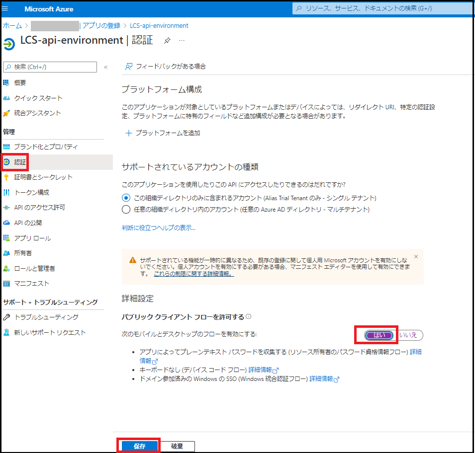
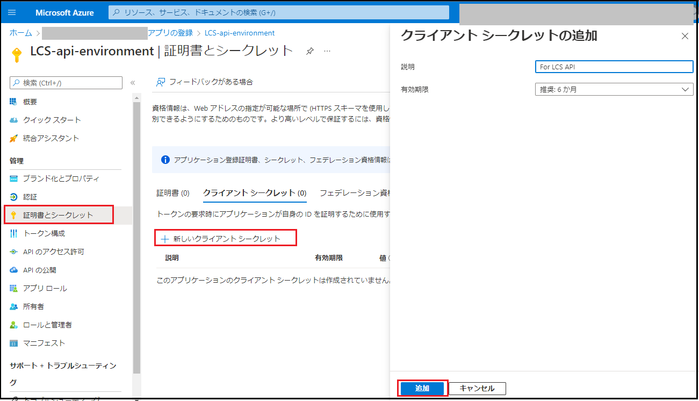
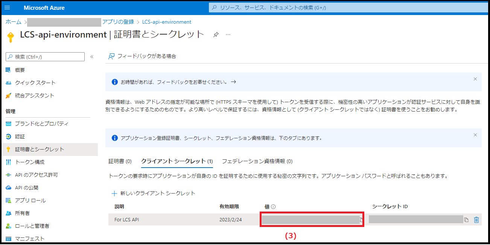
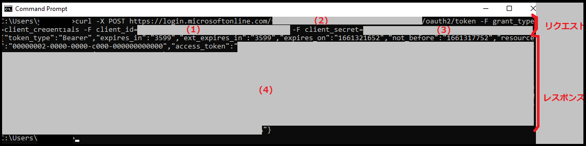

こんにちは、日本マイクロソフトの福原です。

この記事では、Dynamics Lifecycle services (LCS) のAPIの使い方を紹介します。
<!-- more -->

- [LCS プロジェクト内の環境の一覧の取得](#lcs-プロジェクト内の環境の一覧の取得)
- [HTTPリクエスト送信の例として、まずはcurlコマンドを使用したクラウドホスト環境の起動と停止を行います。](#httpリクエスト送信の例としてまずはcurlコマンドを使用したクラウドホスト環境の起動と停止を行います)
- [注意](#注意)
- [おわりに](#おわりに)


---------------

### 事前準備
まず、以下の弊社公開資料の通り、LCSのAPIを呼び出すには、アプリケーションが Microsoft ID プラットフォームからアクセス トークンを取得するために、Azure ポータルにて新しいアプリケーションを登録する必要があります。
https://docs.microsoft.com/ja-jp/dynamics365/fin-ops-core/dev-itpro/database/api/dbmovement-api-authentication

Azure Portal (https://portal.azure.com/) にサインインし、Azure Active Directory サービスを選択し、アプリ登録 > 新規登録 を選択します。


アプリケーション名を含む各項目を設定し、登録をクリックします。


作成されたアプリケーションのアプリケーション (クライアント) ID (1)、ディレクトリ (テナント) ID (2)は後の手順で必要となります。



作成されたアプリケーションに対して、APIのアクセス許可から、Dynamics Lifecycle services のアクセス許可を追加します。





アクセス許可を追加後、Tenantに管理者の許可を与えます。



> [!NOTE]
> インタラクティブに許可を与えたい場合には、以下の弊社公開資料内のAzure Active Directory に関する公開資料をご確認頂きますようお願い申し上げます。
> https://docs.microsoft.com/en-us/dynamics365/fin-ops-core/dev-itpro/database/api/dbmovement-api-authentication#step-2-configure-api-permissions
> `After the required permissions are added to the application, select Grant admin consent to complete the setup. This is necessary when you want to allow users to access your app right away, instead of requiring an interactive consent experience. If you can support interactive consent, we recommend following the Microsoft identity platform and OAuth 2.0 authorization code flow (https://docs.microsoft.com/en-us/azure/active-directory/develop/v2-oauth2-auth-code-flow).`


認証の詳細設定にて、"パブリック クライアント フローを許可する" を"はい" に設定します。


<!---

また、作成されたアプリケーションに対して、証明書とシークレットから、新しいクライアントシークレットを作成します。


作成されたシークレットの値 (3)は後の手順で必要となります。


-->

上記の通り、アプリケーションの登録及び、(1)クライアントID、(2)テナントIDが用意できましたら、その情報によりアクセストークンを発行し、発行されたアクセストークンを用いることでLCSのAPIを呼べるようになります。

アクセストークンの発行のため、コマンドプロンプトを起動し、以下のコマンドを実行します。
なお、コマンド内の{client_id}には上記(1)クライアントIDの値、{tenant_id}には上記の(2)テナントIDの値、{username}には使用しているユーザーのメールアドレス、{password}にはパスワードを入れます。
```
curl -X POST https://login.microsoftonline.com/{tenant_id}/oauth2/v2.0/token -F client_id={client_id} -F scope=https://lcsapi.lcs.dynamics.com//.default -F username={username} -F password={password} -F grant_type=password
```

上記のコマンドを実行しますと、リクエストに対して、レスポンスが返ってきます。
レスポンス内の"access_token" の値 (eyJ)が発行されたアクセストークンとなります。
```
{"token_type":"Bearer","scope":"https://lcsapi.lcs.dynamics.com//user_impersonation https://lcsapi.lcs.dynamics.com//.default","expires_in":5290,"ext_expires_in":5290,"access_token":"eyJ............."}
```

<!---

-->


上記の手順により、Dynamics Lifecycle servicesのAPIの呼び出しの準備ができました。
発行されたアクセストークンを含めたHTTPリクエストを各APIのエンドポイントに送信することにより、LCSで提供しているAPIを利用することができます。

## LCS プロジェクト内の環境の一覧の取得
以下のようなリクエストによりLCS プロジェクト内の環境の一覧を取得することができます。
```
curl -X GET https://lcsapi.lcs.dynamics.com/environmentinfo/v1/detail/project/1750229/?page=1 -H "Content-Type: application/json" -H "'x-ms-version': '2017-09-15'" -H "Authorization: Bearer eyJ....."
```

## HTTPリクエスト送信の例として、まずはcurlコマンドを使用したクラウドホスト環境の起動と停止を行います。


## 注意
品質更新プログラムの適用にあたり、対象環境にはダウンタイムが発生します。関連するサービスはすべて停止し、パッケージの適用中は環境を使用できなくなります。


上記の手順、手順内の画像については本記事の執筆時のものです。
実際の画面とは挙動に違いがある可能性がございます。

---
## おわりに  

以上、Dynamics 365 Finance and Operationsにて、品質更新プログラムを適用する方法をご紹介させていただきました。
もし、お困りのこと等がございましたら、弊社までお問い合わせ頂きますようお願いいたします。
