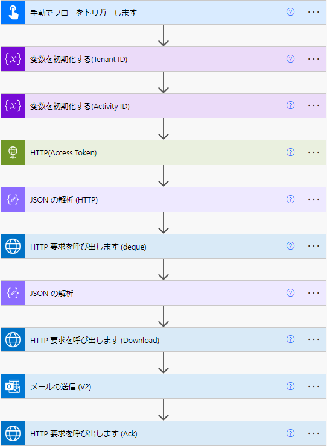
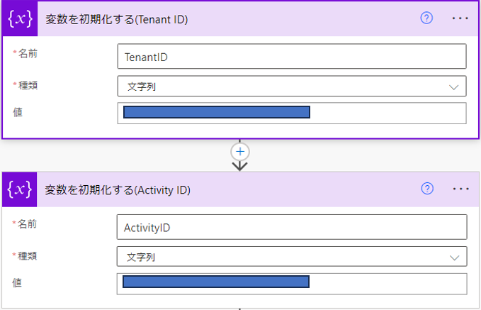
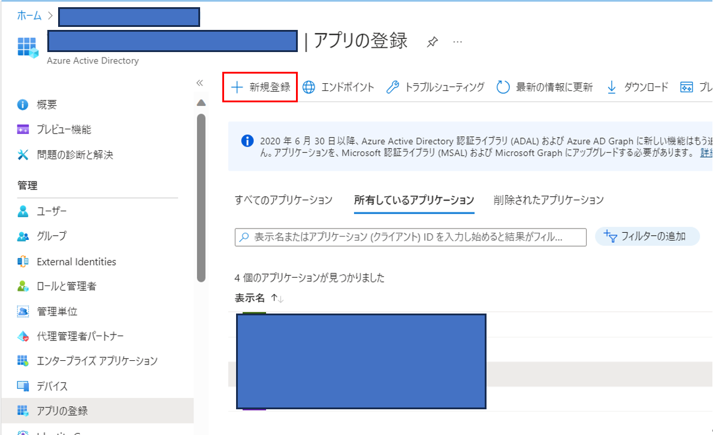
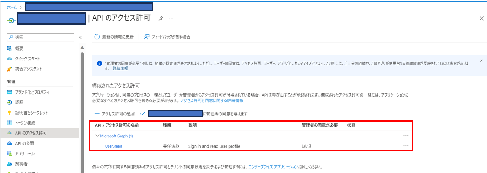
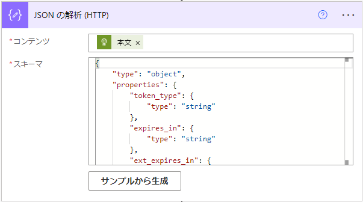
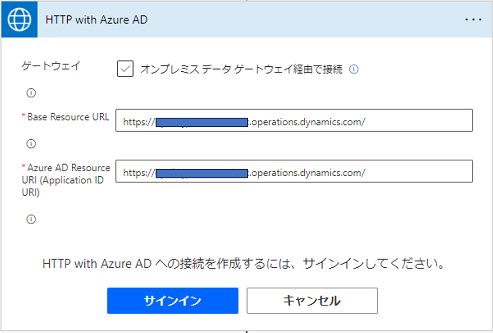
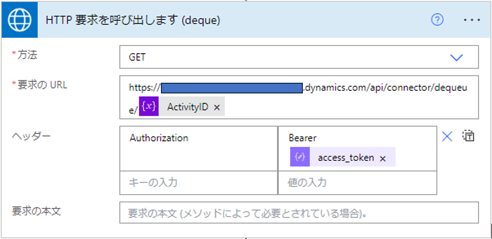
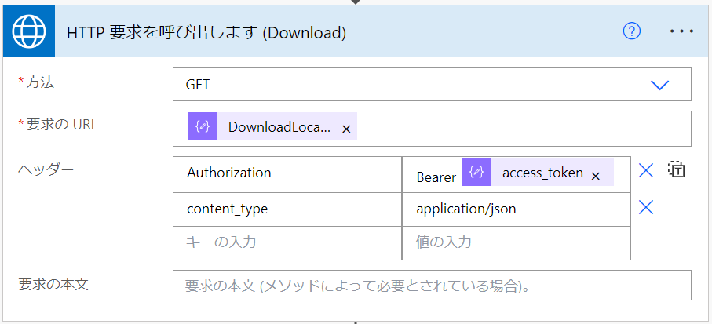
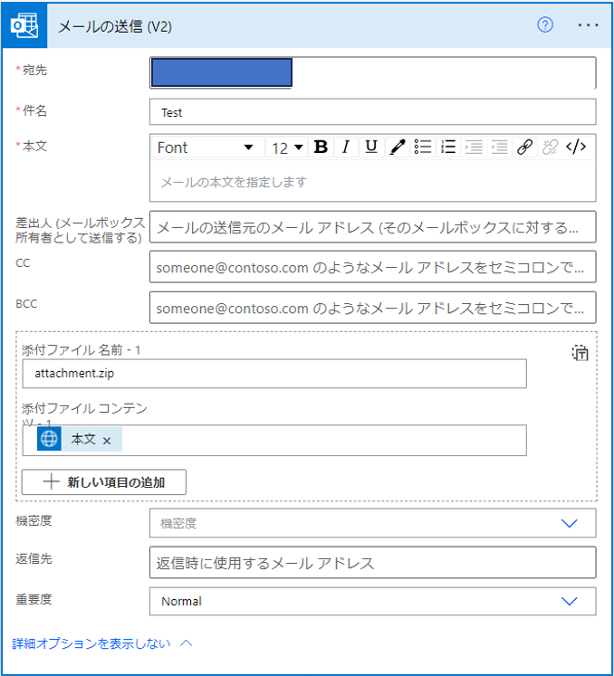
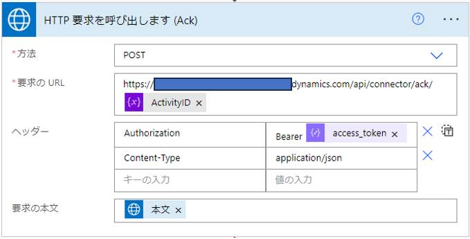

こんにちは、日本マイクロソフトの佐藤です。
この記事では、定期統合の REST API の実行をご案内します。
この手順により、定期的なデータジョブを実行した際にそのジョブに関するメッセージ状態を "キューから削除"、"ダウンロード済み"、"確認済み" のステータスに変更し、管理することができます。
今回は Power Automate を使用して、一連のフローを説明します。

<!-- more -->
## 検証に用いた製品・バージョン
Dynamics 365 Finance and Operations
Application version: 10.0.33
Platform version: PU57

## 作成するフロー
最終的なフローとしては、下記のフローを作成します。



## 定期的なデータ ジョブの管理に必要な値
以下の手順は、下記の docs に記載されている内容を参照とした手順となっております。

[定期統合](https://learn.microsoft.com/ja-jp/dynamics365/fin-ops-core/dev-itpro/data-entities/recurring-integrations)

後ほど使用するため、以下の ２ つの値においては、変数を設定しておきます。



Tenant ID : 

接続先のテナント ID

Activity ID : 

[データ管理]　ワーク スペースからの[すべてのプロジェクト]から対象のプロジェクトを選択し、[管理] タブの [定期的なデータジョブの管理] から、IDより確認できます。


## アクセス トークンの取得
Power Automate からアクセス トークンを取得します。

1. アクセスする Azure Active Directory にアプリケーションを登録し、そのアプリケーションの各値を用います。

アプリケーションは [Azure Portal](https://portal.azure.com/) で [Azure Active Directory] を選択して[アプリの登録] から作成できます。


アプリケーションを登録したら [概要] から "アプリケーション ID" をコピーしておきます。

また、[証明書とシークレット] から新しいクライアント シークレットを作成し、値をコピーします。シークレット IDではないため、注意してください。

[APIのアクセス許可] が下記のように [Microsoft Graph] が設定されていることを確認します。


2. Power Automateの画面で [HTTP] コネクタの [HTTP] アクションを選択し、下記のように設定します。


client_id には Application ID、 client_secret にはシークレット値を入力します。
```javascript
URI : 
https://login.microsoftonline.com/<Tenant ID>/oauth2/token

Header : 
{
  "Content-Type": "application/x-www-form-urlencoded"
}

Body : 
client_id=***&client_secret=***&resource=<Environment URL>&grant_type=client_credentials
```

3. Power Automate の画面で [JSONの解析] アクションを選択し、下記のように設定します。

コンテンツは [HTTP] アクションの本文を指定し、スキーマは下記を入力します。

```javascript
{
    "type": "object",
    "properties": {
        "token_type": {
            "type": "string"
        },
        "expires_in": {
            "type": "string"
        },
        "ext_expires_in": {
            "type": "string"
        },
        "expires_on": {
            "type": "string"
        },
        "not_before": {
            "type": "string"
        },
        "resource": {
            "type": "string"
        },
        "access_token": {
            "type": "string"
        }
    }
}
```



## 定期的なデータ ジョブの REST API
メッセージ 状態を "キューから削除"、"ダウンロード済み"、"確認済み" のステータスに変更する手順をご案内します。

## キューから削除 (Deque)
ステータスを "キューから削除" にするためのアクションになります。

以降は [HTTP with Azure AD] コネクタの [HTTP要求を呼び出します] アクションを使用します。
そのため下記の接続設定画面で、[BaseResourceURL] と [AzureADResourceURI] に接続先の環境URLを入力します。


方法にGETを設定し、各値を設定します。
```javascript
GET

Request URL : 
<Environment URL>/api/connector/dequeue/<Activity ID>

Header : 
{
  "Authorization": "Bearer @{body('JSON_の解析_(HTTP)')?['access_token']}"
}
```


## ダウンロード
ステータスを "ダウンロード済み" にするためのアクションになります。

[キューの削除(Deque)](#キューの削除deque)で出力されたボディから、ダウンロード リンクを取得します。

1. [JSONの解析] アクションを選択し、コンテンツは [キューの削除(Deque)](#キューの削除deque)の [HTTP] アクションの本文を指定し、スキーマは下記を入力します。

```javascript
{
    "type": "object",
    "properties": {
        "CorrelationId": {
            "type": "string"
        },
        "PopReceipt": {
            "type": "string"
        },
        "DownloadLocation": {
            "type": "string"
        },
        "IsDownLoadFileExist": {
            "type": "boolean"
        }
    }
}
```


2. [JSONの解析] アクション後、[HTTP with Azure AD] コネクタの [HTTP要求を呼び出します] アクションを使用します。

Request URL には、先ほどの [JSONの解析] アクションで出力される DownloadLocation を入力します。

```javascript
GET

Request URL :
@{body('JSON_の解析')?['DownloadLocation']}

Header : 
{
  "Authorization": "Bearer @{body('JSON_の解析_(HTTP)')?['access_token']}",
  "content_type": "application/json"
}
```



ダウンロードしたファイルは例として、下記のようなアクションを続けることで、メールにて送付することもできます。

添付ファイル名は ***.zip と zip ファイルの形式に設定することに注意してください。
添付ファイル コンテンツは ダウンロードの [HTTP要求を呼び出します] アクションで出力されるボディを設定します。



## 確認 (Acknowledge)
ステータスを "確認済み" にするためのアクションになります。

[HTTP with Azure AD] コネクタの [HTTP要求を呼び出します] アクションを使用します。
要求の本文には、[キューの削除(Deque)](#キューの削除deque) で出力されたボディをそのまま入力します。

```javascript
POST

Request URL :
<Environment URL>/api/connector/ack/<ActivityID>

Header : 
{
  "Authorization": "Bearer @{body('JSON_の解析_(HTTP)')?['access_token']}",
  "Content-Type": "application/json"
}

Request Body : 
@{body('HTTP_要求を呼び出します_(deque)')}
```



---
## おわりに  
以上、定期統合のREST APIの実行手順をご紹介させていただきました。
もし、お困りのこと等がございましたら、弊社までお問い合わせ頂きますようお願いいたします。  
